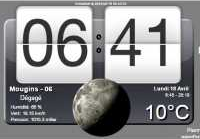
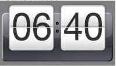
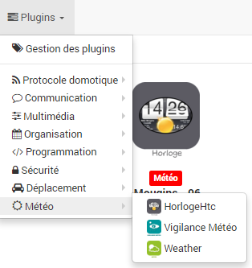
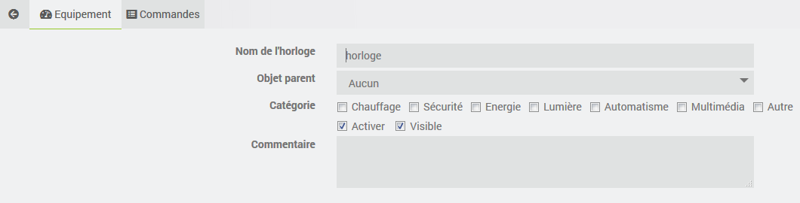
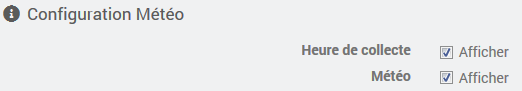
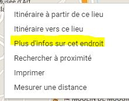
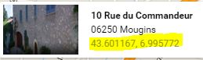
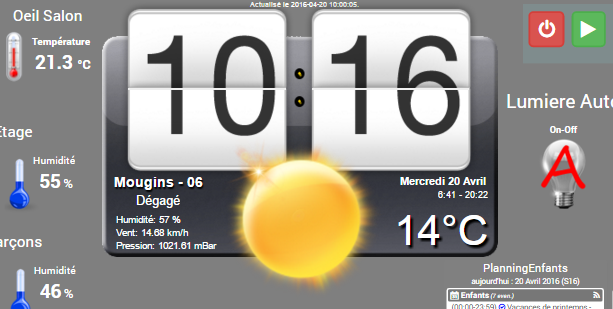

# Plugin Horloge HTC

Ce plugin permet d'afficher une Horloge (style HTC sense) avec ou sans la météo. +

## Configuration du plugin

Une fois le plugin installé via le market, vous devez seulement l'activer.

## Configuration des équipements

Une fois le plugin installé et activé, veuillez vous rendre sur la page de configuration des équipements qui est accessible à partir du menu *Plugins/Metéo/HorlogeHtc*.

La page du plugin regroupe l’ensemble des Horloges configurées:

### Ajouter une horloge

Cliquer sur "Ajouter" pour ajouter une Horloge. Renseignez ensuite les *paramètres*.

Activer ou non l'affichage de l'*heure de collecte* et de la *météo*:

### Configuration météo

En mode Météo actif, les informations sont recupérées toutes les 30 minutes sur le site de ForeCast.io.

#### Coordonnées GPS (Si la météo est activée)

- Aller sur <https://www.google.com/maps/>
- Faite un "clic droit" sur l'endroit qui vous interresse et sélectionner "Plus d'info sur cet endroit"
- Copier/Coller les coordonées.

#### Clef API Forecast.io (Si la météo est activée)

- Aller vous inscrire sur <https://developer.forecast.io/>
- Copier/Coller la clé fournie.

## Présentation du Widget

### Sans météo

### Avec la météo

La transparence est possible en mode Dashboard ou Design afin de pourvoir l'intégrer plus facilement dans vos visuels.

## FAQ

- En cas de problème de récupération de la météo, en mode Météo activé. Verifiez que vous n'avez pas mis d'espace dans les Coordonées GPS.
- Vérifiez vos logs (en mode debug), ils sont très bavard.
- Le resize en mode dashboard n'est pas possible.

## Changelog

[Voir le changelog]({{site.baseurl}}/#language#/changelog/)
