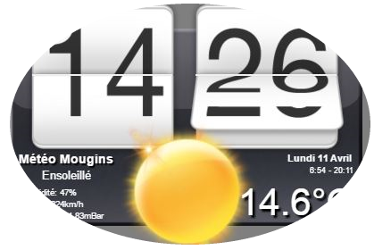
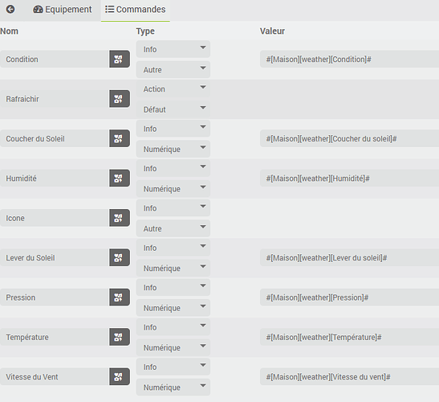
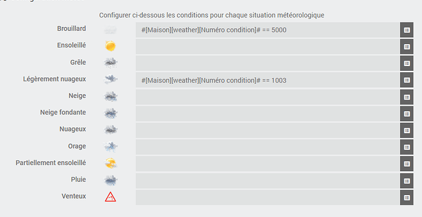

# Plugin Horloge HTC

Ce plugin permet d'afficher une Horloge (style HTC sense) avec ou sans la météo.

## Avec la météo

## Sans météo

# Configuration du plugin

Une fois le plugin installé via le market, vous devez seulement l'activer.

# Configuration des équipements

Une fois le plugin installé et activé, veuillez vous rendre sur la page de configuration des équipements qui est accessible à partir du menu *Plugins/Météo/HorlogeHtc*.

La page du plugin regroupe l’ensemble des Horloges configurées:

## Ajouter une horloge

Cliquer sur "Ajouter" pour ajouter une Horloge. Renseignez ensuite les *paramètres*.

Activer ou non l'affichage de l'*heure de collecte* et de la *météo*:

## Configuration météo

En mode Météo actif, les informations sont récupérées toutes les 30 minutes.

Pour cela vous devez configurer chacune des commandes du plugins (voir onglet commande), vous pouvez récupérer l'information depuis n'importe quelle commande Jeedom: un plugin météo de votre choix, un équipement local...

Vous devez également configurer les conditions pour déterminer quelle icône sera affichée sur le widget:

# Changelog

[Voir le changelog]({{site.baseurl}}/#language#/changelog/)
